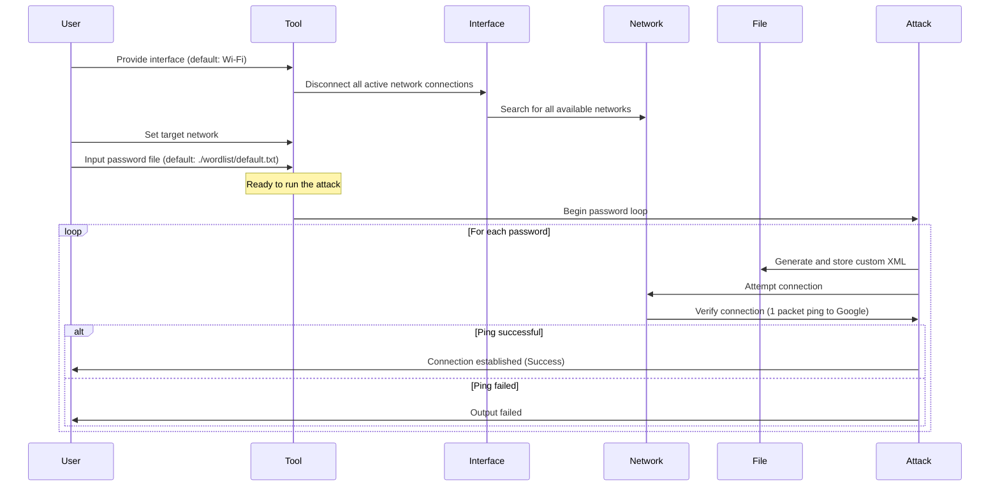

# WinFiHack

```bash
__        ___       _____ _ _   _            _
\ \      / (_)_ __ |  ___(_) | | | __ _  ___| | __
 \ \ /\ / /| | '_ \| |_  | | |_| |/ _` |/ __| |/ /
  \ V  V / | | | | |  _| | |  _  | (_| | (__|   <
   \_/\_/  |_|_| |_|_|   |_|_| |_|\__,_|\___|_|\_\
```

WinFiHack is a recreational attempt by me to rewrite my previous project [Brute-Hacking-Framework's](https://github.com/morpheuslord/Brute-Hacking-Framework-SourceCode) main wifi hacking script that uses netsh and native Windows scripts to create a wifi bruteforcer. This is in no way a fast script nor a superior way of doing the same hack but it needs no external libraries and just Python and python scripts.

## Installation

The packages are minimal or nearly none 😅. The package install command is:

```bash
pip install rich pyfiglet
```

Thats it.

## Features

So listing the features:

- _Overall Features:_
  - We can use custom interfaces or non-default interfaces to run the attack.
  - Well-defined way of using netsh and listing and utilizing targets.
  - Upgradeability
- _Code-Wise Features:_
  - Interactive menu-driven system with `rich`.
  - versatility in using interface, targets, and password files.

## How it works

So this is how the bruteforcer works:



- _Provide Interface:_

  - The user is required to provide the network interface for the tool to use.
  - By default, the interface is set to `Wi-Fi`.

- _Search and Set Target:_

  - The user must search for and select the target network.
  - During this process, the tool performs the following sub-steps:
    - Disconnects all active network connections for the selected interface.
    - Searches for all available networks within range.

- _Input Password File:_

  - The user inputs the path to the password file.
  - The default path for the password file is `./wordlist/default.txt`.

- _Run the Attack:_

  - With the target set and the password file ready, the tool is now prepared to initiate the attack.

- _Attack Procedure:_
  - The attack involves iterating through each password in the provided file.
  - For each password, the following steps are taken:
    - A custom XML configuration for the connection attempt is generated and stored.
    - The tool attempts to connect to the target network using the generated XML and the current password.
    - To verify the success of the connection attempt, the tool performs a "1 packet ping" to Google.
    - If the ping is unsuccessful, the connection attempt is considered failed, and the tool proceeds to the next password in the list.
    - This loop continues until a successful ping response is received, indicating a successful connection attempt.

## How to run this

After installing all the packages just run `python main.py` rest is history 👍 make sure you run this on Windows cause this won't work on any other OS.
The interface looks like this:


## Contributions

For contributions:
- *First Clone:* First Clone the repo into your dev env and do the edits.
- *Comments:* I would apprtiate if you could add comments explaining your POV and also explaining the upgrade.
- *Submit:* Submit a PR for me to verify the changes and apprive it if necessary.
